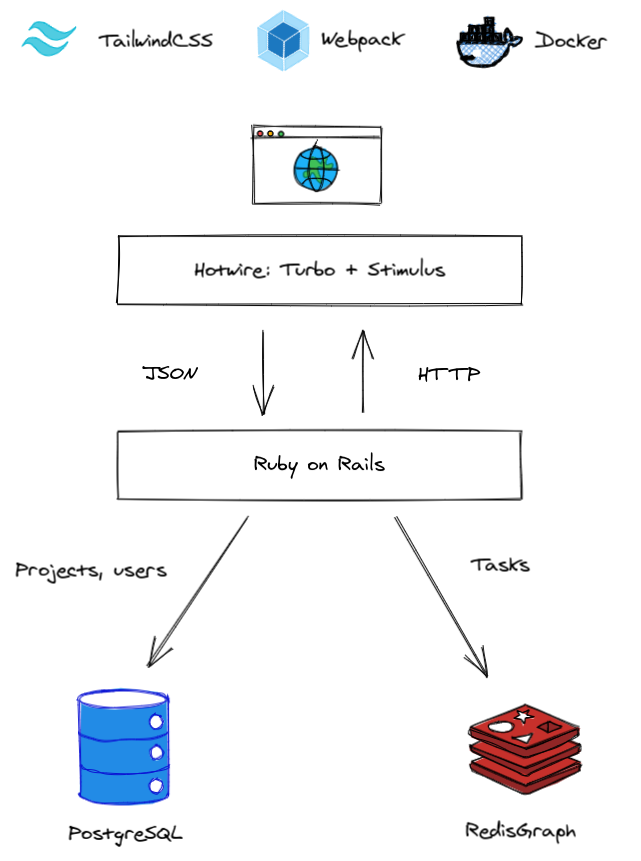

Code Red is a simple project management app, using a graph-based approach to task and resource management.
This app was built for the [Build on Redis Hackathon 2021](https://hackathons.redislabs.com/hackathons/build-on-redis-hackathon).

## What it does

Code Red is a simple app that allows you to manage and visualize your heavily interdependent project using the power of graphs.

A project consists of a single graph, containing many tasks.
A task can be an idea, goal, epic, feature, simple task or bug.
It has a status as well: to do, in progress, in review or done.

Tasks can be linked to each other using a generic link (related to), or a specific relationship (blocked by, child of).

## How it works



The applications stores its data both relationally and in a graph: the former using PostgreSQL, the latter in [RedisGraph](https://oss.redislabs.com/redisgraph/), a Redis module by RedisLabs.
Administrative data (such as users and projects) is stored relationally, while storage of tasks and the relationships between them is delegated to the graph storage.

The web app is plain HTML sprinkled with some JavaScript (Stimulus for interactivity and D3.js for graph visualization).
The HTML is rendered server-side before being sent to the client.
In order to keep the application fast and snappy, [Hotwire](https://hotwire.dev/) was used as a framework.
This means that instead of using JSON to transfer data between the server and client, HTML is sent and only the part of the DOM that changes, is replaced.
Please refer to [Turbo](https://turbo.hotwire.dev/) and [Stimulus](https://stimulus.hotwire.dev/) documentation for more information.

## Setup

First, ensure you have a working Docker environment.

Pull the images and start the containers:

```
docker-compose up -d
```

Set up the PostgreSQL database:

```
docker-compose exec app rails db:setup
```

Load sample data into the PostgreSQL and Redis databases:

```
docker-compose exec app rails database:seed
```

The application should now be available at [http://localhost:3000](http://localhost:3000).

## Development

Use the `bin/update` script to update your development environment dependencies.

If you want to enable faster compilation of assets, run Webpack dev server in the same container as the Rails server:

```
docker-compose exec app bin/webpack-bin-server
```

## Debugging

To debug the server component in your IDE, start the `debug` instead of the `app` container, and connect to `localhost:1234`.

## Testing

Seed the test database before running the test suite:

```
rails database:seed:production RAILS_ENV=test
```

Run the test suite:

```
rspec
```

## Secrets

### Repository secrets

Github secrets for release:

- `DOCKER_TOKEN` (needed for [Github Container Registry](https://docs.github.com/en/packages/getting-started-with-github-container-registry/migrating-to-github-container-registry-for-docker-images))

### Environment secrets

Github secrets for continuous deployment (process):

- `DOCKER_TOKEN` (needed for [Github Container Registry](https://docs.github.com/en/packages/getting-started-with-github-container-registry/migrating-to-github-container-registry-for-docker-images))
- `GANDIV5_API_KEY` (needed for Let's Encrypt integration)
- `SECRET_KEY_BASE`

- `SSH_HOST` (deployment host)
- `SSH_USER` (deployment user)
- `SSH_KEY` (private key)
- `SSH_HOST_KEY` (host public key)

## Releasing

Update the changelog and bump the version in `lib/code_red/version.rb`.
Create a tag for the version and push it to Github.
A Docker image will automatically be built and pushed to the registry.

```sh
nano lib/code_red/version.rb
git add lib/code_red/version.rb
git commit -m "Bump version to v1.0.0"
git tag v1.0.0
git push origin master
git push origin v1.0.0
```

## License

See [LICENSE.md](LICENSE.md).
